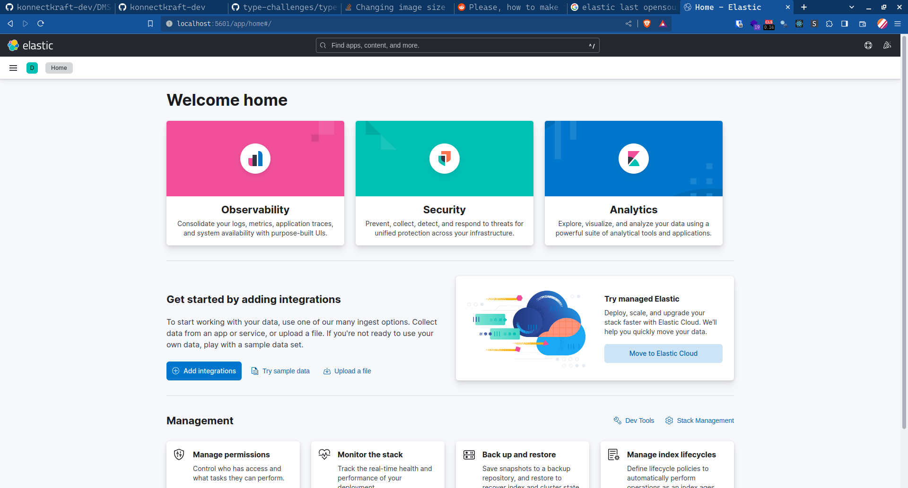

# Getting Started with Elastic Stack

---

## Components

- Elasticsearch
- Kibana
- Logstash
- Beats

---

## Installation

- **Locally:** In your local machine
- **Containerized:** In a container using Docker
- **Managed Services:** In managed cloud services

This article focuses on the containerized version.

---

### Local Installation

The local installation is pretty straight forward, you can go to Elastic's official website and follow the instructions

<https://www.elastic.co/downloads>

---

#### Elasticsearch and Kibana


---

#### Integrations


---

### Managed services

Various cloud services provide managed hosting for elastic search including the creators **Elastic** themselves.

All major cloud service providers, *Azure, AWS, Google*, provide elasticsearch service.

Refer to their documentation to get started.

---

### Containerized

Elastic offers container images for all their services which can be found in Dockerhub

<https://hub.docker.com/u/elastic>

Additionally, elastic also maintains their own docker repository at

<https://www.docker.elastic.co/>

You can explore these repos to get what you want.

---

#### A. Running Elasticsearch

##### Using docker

1. Download the image

```shell
docker pull docker.elastic.co/elasticsearch/elasticsearch:8.8.1
```

2. Run the image

```shell  
 docker run --rm --name elasticsearch_container \
 -p 9200:9200 -p 9300:9300 -e "discovery.type=single-node" \
 -e "xpack.security.enabled=false" \
 docker.elastic.co/elasticsearch/elasticsearch:8.8.1
```

Elasticsearch runs in port 9200  of localhost.  

---

##### Checking the instance

###### Using curl

Making sure to have curl installed in your system, use the following command in your terminal shell

```shell
curl http://localhost:9200
```

---

Output


---

###### Using browser

If you navigate to <http://localhost:9200> in your browser, you'll see.


---

### Using Elasticsearch

Lets perform some basic CRUD operations on elaticsearch to consume some data

---

#### Some basic concepts

- **Index:** An index is a logical grouping of documents that share a common schema. A schema defines the structure of the documents in an index. It specifies the fields that are allowed in each document, as well as the data types of those fields.
- **Document:** A document is a unit of data in Elasticsearch. It is a JSON object that contains a set of fields. The fields in a document can be of different data types, such as text, numbers, or dates.

---

- **Field:** A field is a piece of data in a document. It is a key-value pair, where the key is the name of the field and the value is the data stored in the field.
- **Type:** A type is a way to group similar documents in an index. A type is not required, but it can be used to improve the performance of queries.

---

- **Shard:** A shard is a physical copy of an index. Shards are distributed across the nodes in a cluster to improve performance and availability.
- **Replica:** A replica is a copy of a shard. Replicas are used to improve the availability of data in case a shard becomes unavailable.
- **Node:** A node is a single server that is part of an Elasticsearch cluster.
- **Cluster:** A cluster is a group of nodes that work together to store and index data.

---

- **Query:** A query is a way to search for data in Elasticsearch. A query can be a simple text search or a more complex query that uses filters and aggregations.
- **Aggregation:** An aggregation is a way to group data in Elasticsearch. Aggregations can be used to count the number of documents in a group, calculate the average value of a field, or find the top documents in a group.

---

#### Working with Elasticsearch

1. Check available indices

```shell
curl -XGET localhost:9200/_cat/indices
```

This will give you the list of indices currently available in elastic search.

---

2. Create an index alongside a document

Consider this sample JSON object of a web novel

```json
{
 "title": "Omniscient Readers Viewpoint",
 "author": "Sing Shong",
 "year": 2018
}
```

Lets create a index `novels` with document `novel` and id `1`

```shell
curl -XPOST localhost:9200/novels/_doc -H 'Content-Type: application/json' -d'
{
 "title": "Omniscient Readers Viewpoint",
 "author": "Sing Shong",
 "year": 2018
}'
```

---

Output


The response is

```json
{ "_index":"novels",
 "_id":"VGsNNYoBoRQolfcFzueT",
 "_version":1,
 "result":"created",
 "_shards":
  {   "total":2, "successful":1, 
   "failed":0}, 
 "_seq_no":2,
 "_primary_term":1}
```

---

3. Check index and documents

Index

```shell
curl -XGET localhost:9200/_cat/indices
```


As you can see, we can now see an index called novels.

The resuls consits of columns of fields explained as

---
`yellow open novels d34IS1U6QmediW24lTRtCw 1 1 3 0 16.8kb 16.8kb`

- The first column, `yellow`, is the health of the index. A healthy index is marked as `green`, while an unhealthy index is marked as `yellow` or `red`.
- The second column, `open`, indicates whether the index is open or closed. An open index is available for read and write operations, while a closed index is not.
- The third column, `novels`, is the name of the index.

---
`yellow open novels d34IS1U6QmediW24lTRtCw 1 1 3 0 16.8kb 16.8kb`

- The fourth column, `d34IS1U6QmediW24lTRtCw`, is the index UUID. The UUID is a unique identifier for the index.
- The fifth column, `1`, is the number of shards in the index. A shard is a physical copy of an index.
- The sixth column, `1`, is the number of replicas in the index. A replica is a copy of a shard.

---

`yellow open novels d34IS1U6QmediW24lTRtCw 1 1 3 0 16.8kb 16.8kb`

- The seventh column, `3`, is the number of documents in the index.
- The eighth column, `0`, is the number of deleted documents in the index.
- The ninth column, `16.8kb`, is the size of the index in bytes.
- The tenth column, `16.8kb`, is the size of the index on disk in bytes.

---

Document

```shell
curl -XGET localhost:9200/novels/_doc/VGsNNYoBoRQolfcFzueT
```

Response

```json
{
"_index":"novels",
"_id":"VGsNNYoBoRQolfcFzueT",
"_version":1,
"_seq_no":2,
"_primary_term":1,
"found":true,"  
_source":  
{  
       "title": "Omniscient Readers Viewpoint",  
       "author": "Sing Shong",  
       "year": 2018  
}}
```

---

4. Updating the document  

```json  
 curl -XPUT \
 localhost:9200/novels/_doc/VGsNNYoBoRQolfcFzueT \
 -H 'Content-Type: application/json' --raw -d'
 {
  "title": "Omniscient Reader\u0027s Viewpoint",
  "author": "Sing Shong",
  "year": 2018
 }'
```

Output

```json
{"_index":"novels",
 "_id":"VGsNNYoBoRQolfcFzueT",
 "_version":2,"result":"updated",
 "_shards":
 {"total":2,"successful":1,"failed":0},
 "_seq_no":3,"_primary_term":1}%
```

---

Check document again for changes

```shell
curl -XGET localhost:9200/novels/_doc/VGsNNYoBoRQolfcFzueT
```

Output

```json
{"_index":"novels",
 "_id":"VGsNNYoBoRQolfcFzueT",
 "_version":2,
 "_seq_no":3,
 "_primary_term":1,
 "found":true,
 "_source":
{
        "title": "Omniscient Reader\u0027s Viewpoint",
        "author": "Sing Shong",
        "year": 2018
}}
```

---
Browser


---

5. Delete the document

```shell
curl -XDELETE localhost:9200/novels/_doc/VGsNNYoBoRQolfcFzueT
```

Output

```json
{"_index":"novels",
 "_id":"VGsNNYoBoRQolfcFzueT",
 "_version":3,
 "result":"deleted",
 "_shards":
 {"total":2,"successful":1,"failed":0},
  "_seq_no":4,
  "_primary_term":1}
```

---
Check if deleted

```curl
curl -XGET localhost:9200/novels/_doc/VGsNNYoBoRQolfcFzueT
```

Output

```json
{
 "_index":"novels",
 "_id":"VGsNNYoBoRQolfcFzueT",
 "found":false
}
```

---

6. Search documents

I have inserted multiple of the previous document, so lets search it

```shell
curl -XGET localhost:9200/novels/_search d'
{ "query": 
 { "match": 
  { "author": "sing" } 
 } 
}'
```

---
Output

```json
{"took":3,"timed_out":false,"_shards":{"total":1,"successful":1,"skipped":0,"failed":0},"hits":{"total":{"value":2,"relation":"eq"},"max_score":1.0,
"hits":[
{"_index":"novels","_id":"novel","_score":1.0,"_source":
{
        "title": "Omniscient Readers Viewpoint",
        "author": "Sing Shong",
        "year": 2018
}},{"_index":"novels","_id":"U2sLNYoBoRQolfcFvuf_","_score":1.0,"_source":
{
        "title": "Omniscient Readers Viewpoint",
        "author": "Sing Shong",
        "year": 2018
}}]}}
```

---

### B. Running Kibana

1. Use Docker command

```shell
 docker run -d --name kibana \ 
 -e "ELASTICSEARCH_HOSTS=http://192.168.1.1:9200" \ 
 -p 5601:5601 \ 
 docker.elastic.co/kibana/kibana:8.8.1
```

Remember to enter your local IP address in elastic hosts.

---

Kibana will be loaded after a while.
Go to <localhost:5601> to see the dashboard



---

## END
