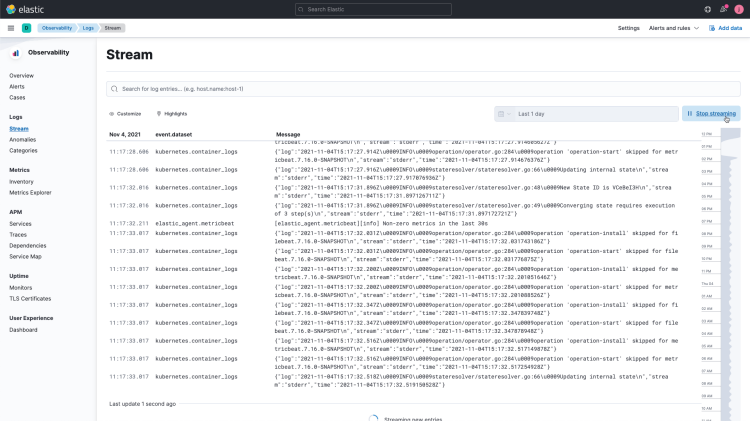
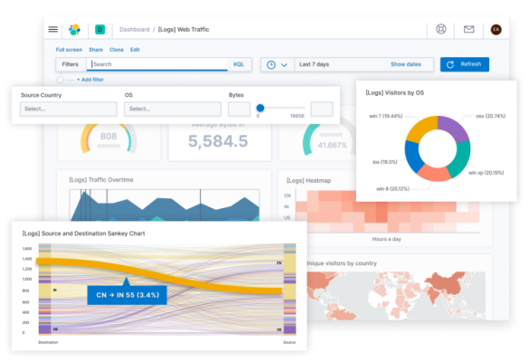
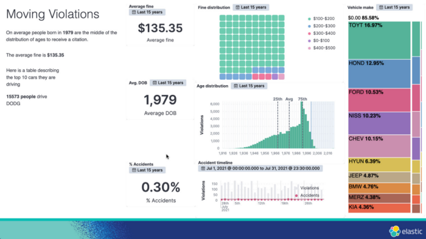
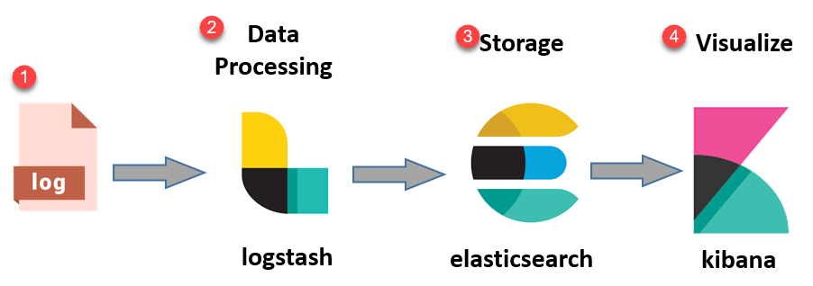
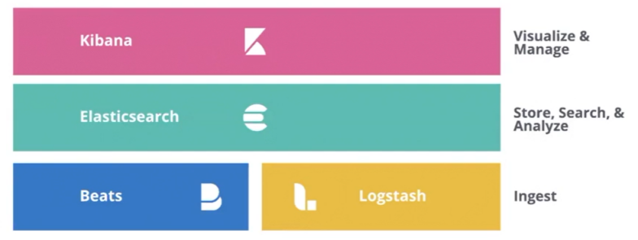

# Elastic Stack

---

## What is the Elastic Stack?

---
  
The **Elastic Stack**, formerly known as the **ELK stack**,  is a set of open-source tools for *data ingestion, enrichment, storage, analysis,* and *visualization*.

It is used by a widely in the industry for a number of purposes.
  
> ***NOTE** : Since version 7.10.2, Elastic, the creator and maintainer, has closed licensed the commercial use of the product leading to a phenomenon of Open Code Closed License*
  
---

## What is it used for?

---

**Log analytics:** It can be used to collect, store, and analyze logs from applications, servers, and other systems which can be used to troubleshoot problems, identify security threats, and improve performance.

---

- **Security monitoring:** It can be used to collect and analyze security events from a variety of sources, such as firewalls, intrusion detection systems, and web application firewalls to detect and respond to security threats.

---

- **Search:** It can be used to search and index large amounts of data. This can be used to find information quickly and easily, such as customer records, product data, or financial transactions.

---

- **Monitoring:** It can be used to monitor infrastructure metrics, such as CPU usage, memory usage, and network traffic to identify performance problems and optimize resources.

---

- **Analytics:** It can also be used to analyze data to identify trends and patterns and to make better business decisions

---

## Components of Elastic Stack

---

### The ELK stack constitutes

- **Elasticsearch:** Elasticsearch is a distributed, RESTful search and analytics engine. It is the central component of the Elastic Stack and is used to store and index data.
- **Kibana:** Kibana is a visualization tool that allows you to explore and visualize data from Elasticsearch.
- **Logstash:** Logstash is a data pipeline that can be used to collect, parse, and enrich data before sending it to Elasticsearch.

---

---

### New Addition: **BEATS**

---

- **Beats:** Beats are lightweight data shippers that collect data from a variety of sources and send it to Elasticsearch.
*Examples: Filebeat, Metricbeat, Packetbeat, Winlogbeat, Heartbeat, Auditbeat, etc.*

---

## Organizations using the Elastic Stack

      

---

## Open source fork for Elastic Search and Kibana

- **OpenSearch:** Fork for Elastic stack by Amazon
- **OpenSearch Dashboards:** Fork for Kibana also by Amazon

---

---

## END

---
